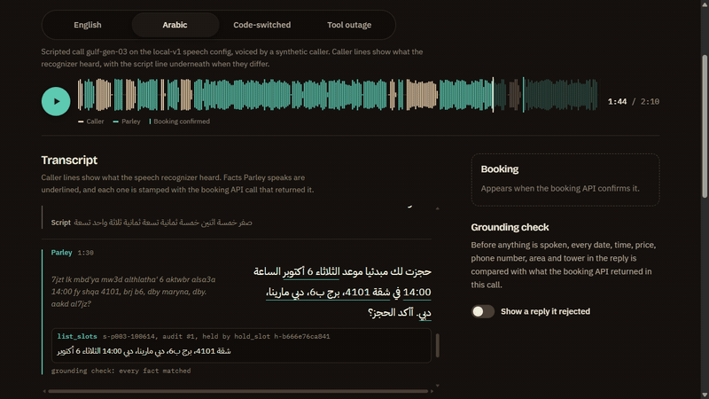
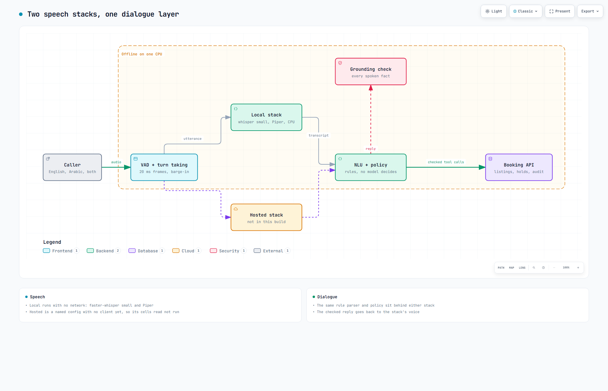
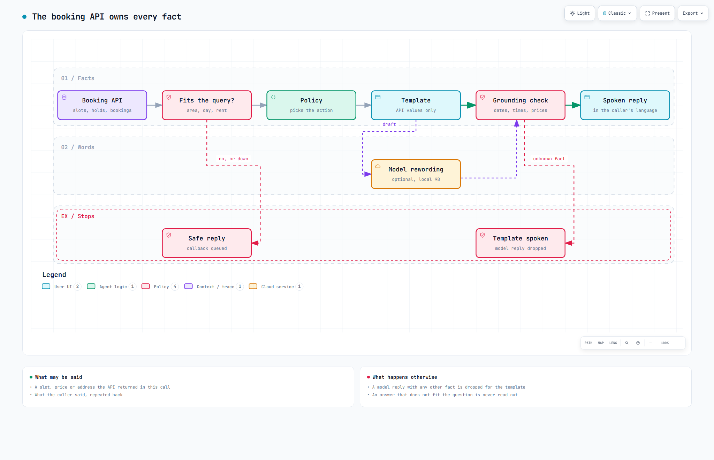
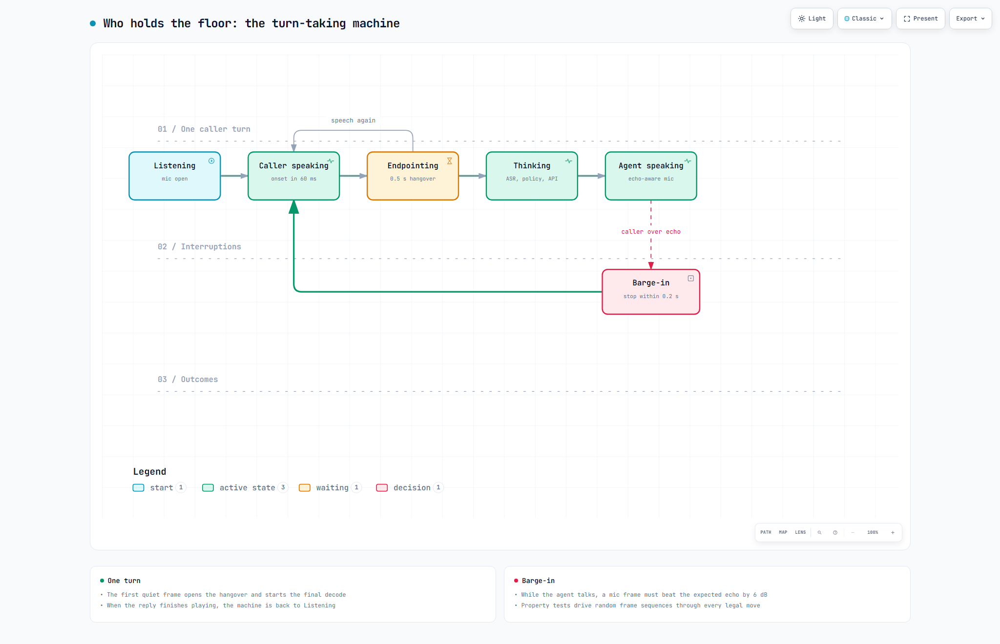
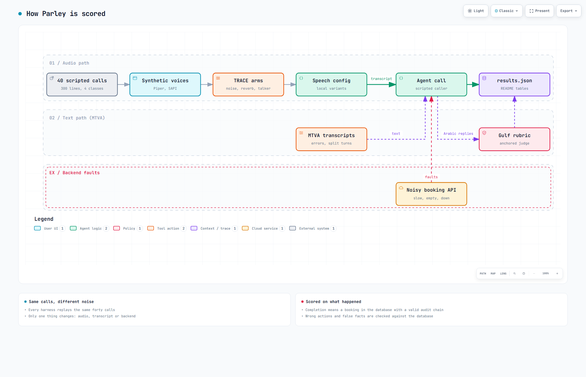

# Parley

Parley answers the phone for a property agency, in English, Gulf Arabic or both in one sentence. It books a
viewing, only ever says prices and addresses the listings database returned, and works with no internet
connection.

**Demo:** [samad-zeeshan.github.io/Parley](https://samad-zeeshan.github.io/Parley/) replays recorded calls in English, Arabic and a mix of both, plus one where the booking system fails mid-call. Each fact Parley speaks is marked with the booking API call it came from. A longer recording is in [docs/demo.mp4](docs/demo.mp4).



## How it works

Either speech stack feeds the same rule parser, policy and booking API.


Every date, time, price and address in a reply is checked against what the booking API returned in this call.


Who holds the floor is a small state machine, so a caller can talk over the agent and it stops.


The same scripted calls are replayed with clean audio, stressed audio, corrupted transcripts and a failing backend.

## Design decisions
- `local` (faster-whisper small and Piper on one CPU) is what a customer would run today: no network, no per-minute fee. `hosted` has a column in every table but no client or credentials yet, so it reads "not run".
- No model decides the next step or states a slot. Replies are templates. A local model may reword them, and any rewording with an unknown fact is dropped.
- When the booking API is slow, down or contradicts itself, Parley says it cannot confirm anything, claims neither success nor failure, and queues a callback.
- A caller turn cut into two messages is joined before parsing. This fixed split turns and cost a little under heavy transcript noise. Both rows are below.
- The v1 speech prompt stays the default: the mixed-language prompt keeps English words intact but loses Arabic ones.

## Results
Scripted calls in English, Gulf Arabic, MSA and code-switched Gulf Arabic with English, on one laptop CPU. All caller voices are synthetic, and the only offline Arabic voice is Jordanian, so Gulf rows test Gulf wording, not a Gulf accent.
No real dialect audio was used: no public Bulbul release was found and the NADI 2026 sets state no licence. Tables come from `eval/results.json` (v1 from `eval/results_v1.json`) and CI fails if they drift.

<!-- results:begin -->
Calls booked by the scripted callers, rule parser:

| calls booked | v1 (8 calls) | local | local, fuzzy parser | mixed prompt | two-pass decode | hosted |
|---|---|---|---|---|---|---|
| English | 2/2 | 6/10 | 8/10 | 7/10 | 7/10 | not run |
| Gulf Arabic | 2/2 | 8/10 | 8/10 | 4/10 | 3/10 | not run |
| MSA | 1/2 | 3/10 | 4/10 | 1/10 | 1/10 | not run |
| Code-switched | 0/2 | 0/10 | 0/10 | 0/10 | 1/10 | not run |
| All | 5/8 | 17/40 | 20/40 | 12/40 | 12/40 | not run |
| Wrong actions | n/a | 5 | 6 | 5 | 3 | not run |
| Replies with an ungrounded fact | 0 | 0 | 0 | 0 | 0 | not run |

Code-switched lines scored per language as in arXiv 2605.19069. WER on the English words: local 0.500, mixed prompt 0.237, two-pass decode 0.108, hosted not run. WER on the Arabic words: local 0.695, mixed prompt 0.808, two-pass decode 0.350, hosted not run. English words kept in Latin script: local 0.552, mixed prompt 0.861, two-pass decode 0.990, hosted not run.

The dialogue layer alone on the same calls, MTVA style (arXiv 2609.20152):

| transcript | transcript WER | rules intent | rules slot F1 | rules booked | rules, no carry-over booked | Jev intent | Jev booked | 9B intent | 9B booked | reply language kept |
|---|---|---|---|---|---|---|---|---|---|---|
| reference text | 0.000 | 0.895 | 0.977 | 38/40 | 38/40 | 0.642 | 27/40 | 0.794 | 36/40 | 1.000 |
| local ASR text | 0.390 | 0.642 | 0.623 | 17/40 | 18/40 | 0.693 | 14/40 | 0.574 | 13/40 | 0.906 |
| hosted ASR text | not run | not run | not run | not run | not run | not run | not run | not run | not run | not run |
| 5% injected errors | 0.050 | 0.800 | 0.891 | 34/40 | 35/40 | not run | not run | not run | not run | 0.991 |
| 10% injected errors | 0.097 | 0.724 | 0.807 | 34/40 | 34/40 | 0.609 | 25/40 | 0.668 | 34/40 | 0.982 |
| 20% injected errors | 0.202 | 0.534 | 0.620 | 21/40 | 25/40 | not run | not run | not run | not run | 0.980 |
| 30% injected errors | 0.293 | 0.425 | 0.509 | 9/40 | 9/40 | 0.506 | 5/40 | 0.435 | 9/40 | 0.978 |
| split turns | 0.000 | 0.867 | 0.859 | 29/40 | 0/40 | 0.646 | 20/40 | 0.768 | 29/40 | 0.945 |

With the 9B model rewording replies, on reference text 265 model replies spoken, 51 rejected, reply language kept 1.000, 0 replies with an ungrounded fact. Then on local ASR text 454 model replies spoken, 70 rejected, reply language kept 0.905, 0 replies with an ungrounded fact.

Acoustic stress on the local config, TRACE style (arXiv 2609.29452), plot in `eval/trace.svg`:

| arm (local) | English | Gulf Arabic | MSA | Code-switched | wrong actions | recovered after trouble | extra turns | hosted |
|---|---|---|---|---|---|---|---|---|
| clean | 6/10 | 8/10 | 3/10 | 0/10 | 5 | 14/37 | 0.0 | not run |
| white@20 | 7/10 | 5/10 | 4/10 | 0/10 | 6 | 13/37 | 1.4 | not run |
| white@10 | 6/10 | 2/10 | 3/10 | 0/10 | 7 | 7/36 | -2.6 | not run |
| white@5 | 7/10 | 0/10 | 4/10 | 0/10 | 9 | 8/37 | 0.9 | not run |
| babble@20 | 6/10 | 6/10 | 6/10 | 0/10 | 4 | 14/36 | 0.1 | not run |
| babble@10 | 6/10 | 5/10 | 3/10 | 0/10 | 3 | 11/37 | -0.7 | not run |
| babble@5 | 6/10 | 0/10 | 4/10 | 0/10 | 7 | 7/37 | 0.2 | not run |
| reverb@0.3 | 7/10 | 6/10 | 1/10 | 0/10 | 11 | 11/37 | -1.6 | not run |
| reverb@0.8 | 6/10 | 2/10 | 2/10 | 0/10 | 6 | 8/38 | -0.8 | not run |
| competing | 6/10 | 3/10 | 3/10 | 0/10 | 13 | 10/38 | 0.2 | not run |

Turn latency on the development CPU, all turns, target 1.5 s. Timed from when the caller's 0.5 s pause closes the turn. Early decode starts recognition on the first quiet frame:

| speech config | booked | p50 (s) | p95 (s) | p95 without early decode (s) |
|---|---|---|---|---|
| v1 (whisper small) | 5/8 | 2.38 | n/a | 4.17 |
| local (whisper small) | 17/40 | 1.78 | 4.26 | 4.76 |
| mixed prompt | 12/40 | 1.55 | 3.82 | 4.32 |
| two-pass decode | 12/40 | 1.82 | 4.74 | 5.24 |
| whisper base | 7/40 | 0.33 | 1.44 | 1.94 |
| whisper tiny | 6/40 | 0.16 | 1.22 | 1.68 |
| hosted | not run | not run | not run | not run |

Booking API faults on reference text (arXiv 2608.02372, 2606.31307), calls booked: clean 38/40, slow 9/40, empty 0/40, contradictory 0/40, contradictory-confirm 38/40, down 0/40, down-at-confirm 0/40. False facts spoken in all modes: 0. Calls that hit a fault and were handled safely: 232/232. Callbacks queued: 78. Hosted: not run.

Gulf dialect rubric (arXiv 2608.29990), calibrated score out of 1: agent templates 0.917 over 19 replies, 9B rewordings 0.679 over 40 (penalties: register flattening 24, wrong dialect 22, hallucination 10, ambiguous framing 3). Judge qwen/qwen3.6-35b-a3b agrees with 13 labelled anchors on 0.815 of criteria. Native-speaker spot check not done yet.

Barge-in, agent stopped within 0.2 s of the caller: English 77/82 (v1 5/6), Gulf 117/121 (v1 10/11), MSA 132/139 (v1 17/18), code-switched 136/146 (v1 22/22). Slowest stop 0.40 s, and false stops on the agent's own echo: 0.
<!-- results:end -->

What the numbers say: grounding held in every run and under every backend fault. Most Arabic and nearly all code-switched calls still fail on speech recognition, and the one code-switched success leans on the pauses a TTS caller leaves between languages.
No local config is both fast and accurate: only the small Whisper models meet the latency target, and they book the fewest calls. Noise hurts Gulf Arabic most, and a competing talker causes the most wrong actions.
Code-switched barge-in is lower than v1 on a far larger sample. The rubric judge has not been checked by a native speaker, so its scores are a gauge only.

## Run it
```
uv sync && uv run pytest                                          # hermetic suite, no models needed
uv run --extra speech python -m eval.run_eval --speech local-v1   # the scripted calls on the local stack
uv run --extra speech uvicorn api.server:app --port 8000          # push-to-talk page at 127.0.0.1:8000
```

## Papers
- Evaluation: arXiv 2609.20152 (MTVA-Bench), 2609.29452 (acoustic stress, TRACE), 2605.19069 (code-switching ASR), 2609.21084 (digit error rates)
- Dialect and judging: arXiv 2608.29990 (Saudi dialect rubric), 2609.29431 (calibrating LLM judges), 2605.16364 (WASIL, in-the-wild Arabic turns)
- Failures and turn taking: arXiv 2608.02372 (PredAct-Bench), 2606.31307 (safe recovery when the database fails), 2609.03321 (finite-state turn taking)
- Models and data: arXiv 2609.23959, 2609.26550 (Jev decisions), 2609.25176, 2609.11892, 2609.27086, 2609.24410, 2609.03423, 2609.23955, 2608.21950, 2604.14186

## Licence
MIT.
